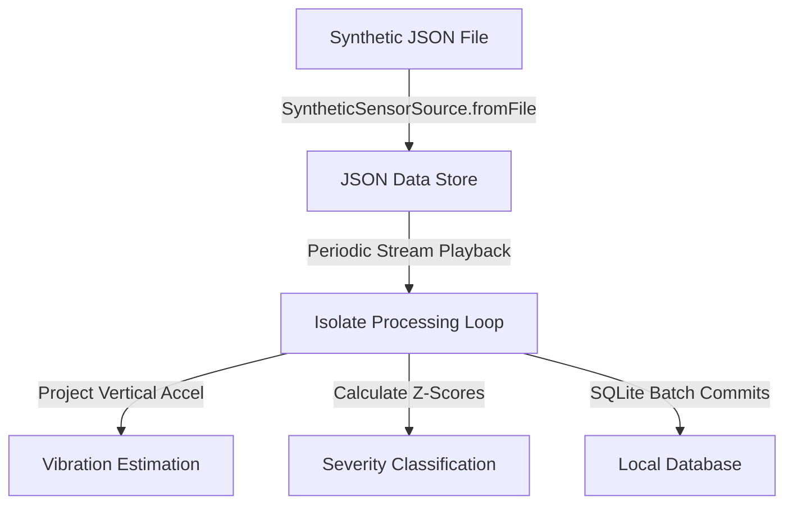

# Synthetic Data Playback Specification

This document details the architecture, data formats, and ingestion mechanics of the synthetic sensor simulator within the **Road Quality Mapper** app.

---

## 1. Overview and Purpose

Testing road quality mapping systems under real-world conditions requires physically driving over various terrains. This is slow, unsafe for boundary testing, and difficult to reproduce consistently. 

The **Synthetic Data Simulator** solves this by:
1.  **Deterministic Reproduction**: Ingesting high-fidelity pre-recorded or modeled vehicle trips to verify that the math filters run identically across multiple code revisions.
2.  **Safety & Edge-Case Testing**: Safely simulating severe impacts (high-G potholes) or extreme driving dynamics (e.g., stationary at a red light, device rotation, mount slipping) without exposing physical vehicles or personnel.
3.  **Cross-Platform Parity**: Enabling automated headless testing in CI environments where physical sensors (accelerometer, gyroscope, GPS) are unavailable.

---

## 2. Ingestion Architecture

The synthetic simulator intercepts hardware sensor streams and substitutes them with a simulated provider (`SyntheticSensorSource`).



### Stream Substitution
In [sensor_source.dart](file:///Users/suyashpandya/Desktop/pothole_finder/lib/sensor_source.dart), the `SensorSource` abstract class exposes uniform Dart streams:
*   `Stream<AccelerometerEvent> get accelerometer`
*   `Stream<UserAccelerometerEvent> get userAccelerometer`
*   `Stream<GyroscopeEvent> get gyroscope`
*   `Future<Position> getCurrentPosition()`

During active runtime, if a `replayFilePath` is supplied, `sensorIsolateEntry` initializes the `SyntheticSensorSource` instead of `RealSensorSource`.

---

## 3. JSON Data Schema

Synthetic trace files are represented as a single JSON object containing separate coordinate arrays for IMU and GPS samples.

```json
{
  "imu": {
    "ax": [-0.012, 0.005, -0.002],
    "ay": [0.034, 0.021, 0.045],
    "az": [0.998, 1.002, 0.985]
  },
  "gps": {
    "lat": [37.773972, 37.774105],
    "lon": [-122.431297, -122.431180],
    "speed": [8.33, 9.15]
  }
}
```

### JSON Fields Description

| Group | Field Name | Type | Unit | Description |
| :--- | :--- | :--- | :--- | :--- |
| **imu** | `ax` | `List<double>` | $g$ | Lateral horizontal acceleration relative to phone chassis. |
| | `ay` | `List<double>` | $g$ | Longitudinal acceleration (travel vector) relative to chassis. |
| | `az` | `List<double>` | $g$ | Vertical acceleration (aligned with gravity at rest) relative to chassis. |
| **gps** | `lat` | `List<double>` | Decimal Degrees | Latitude coordinates of the vehicle location. |
| | `lon` | `List<double>` | Decimal Degrees | Longitude coordinates of the vehicle location. |
| | `speed` | `List<double>` | $m/s$ | Current movement speed. Used for speed-gating thresholds. |

---

## 4. Playback and Conversion Mathematics

The synthetic generator must convert simulation data formatted in gravitational g-units ($g$) to standard metric sensor values ($m/s^2$).

### 1. Acceleration Scale and Offset Conversion
Hardware accelerometers on mobile devices (via `sensors_plus`) report raw measurements in $m/s^2$. Synthetic data files store values relative to earth's standard gravity ($1g \approx 9.81 \, m/s^2$).
The conversion is performed as:
*   **Total Accelerometer (with gravity)**:
    $$\vec{a}_{accel} = [0, 0, 1.0] \times 9.81 \, m/s^2 = [0, 0, 9.81] \, m/s^2$$
*   **User Accelerometer (dynamic motion, gravity removed)**:
    $$u_x = ax[i] \times 9.81$$
    $$u_y = ay[i] \times 9.81$$
    $$u_z = (az[i] - 1.0) \times 9.81$$

### 2. Time-Based Ingestion Ticks
A periodic timer runs at the current sampling rate `interval` (e.g. `20ms` for Low, `40ms` for Medium, `10ms` for High):
$$\text{Interval Duration} = \frac{1,000,000}{\text{Sampling Rate (Hz)}} \, \text{microseconds}$$
On each periodic timer tick:
1.  Verify if the index $i$ has exceeded the dynamic arrays. If so, cancel playback.
2.  Emit an `AccelerometerEvent` representing a stable mount at rest (simulating gravity vector $[0, 0, 9.81]$).
3.  Emit a `UserAccelerometerEvent` containing scaled offsets: $[u_x, u_y, u_z]$.
4.  Emit a zero-magnitude `GyroscopeEvent` (unless simulating phone handling).
5.  Increment sample index: $i \leftarrow i + 1$.

### 3. GPS Fetching Ticks
The `getCurrentPosition()` method is called asynchronously at the configured GPS sampling rate (e.g. 1Hz, 0.5Hz, 0.2Hz):
*   Return a standard `Position` object containing `latitude`, `longitude`, and `speed` read from `gps` lists at index `_gpsIdx`.
*   Increment the GPS pointer `_gpsIdx`. If it exceeds the available array bounds, clamp to the final coordinate to simulate the vehicle becoming stationary at its destination.

---

## 5. Verification Scenarios

Specific simulation trace scenarios can be loaded dynamically to verify mathematical subsystems:

1.  **Stationary Speed Gate Scenario (`stationary_test.json`)**:
    *   **Setup**: Speed is set to `0.0 m/s`. Active user vertical vibration events are spiked (e.g., $1.5g$).
    *   **Expected Behavior**: Speed gate detects speed $< 5.0 \, km/h$ and fully suppresses vibration scoring. The database shows zero high-G entries.
2.  **Mount Slippage Rotation Scenario (`mount_slippage.json`)**:
    *   **Setup**: Dynamic accelerometer gravity values shift suddenly by $> 10^{\circ}$ within 1 second.
    *   **Expected Behavior**: Mount stability detector sets `_suppressUntilMs` for 3.0 seconds, rejecting false-positive vibration spikes during the transition.
3.  **Pothole Impact Z-Score Scenario (`pothole_impact.json`)**:
    *   **Setup**: Base vibration averages $0.05g$. A single localized dynamic spike of $0.6g$ ($> 4.0\sigma$) is injected.
    *   **Expected Behavior**: Standard deviation baseline detects high deviation. Z-score spikes to $\ge 4.0$. Map segment color changes to `red` (Severe).
